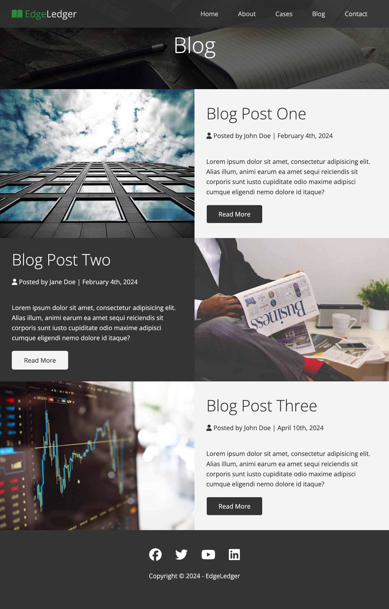
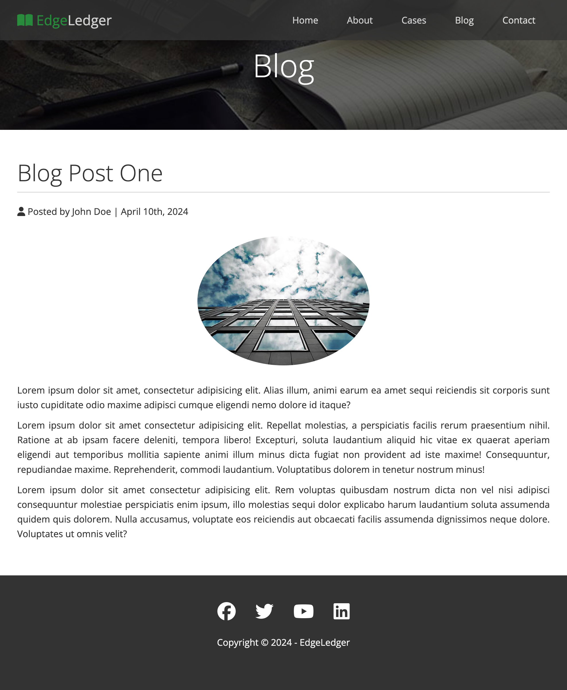

# The project

This project aims to use flexbox to shape the website, instead of floats.

The design is given by the instructor, as well as the colors, fonts, etc

# Responsive Design

The project will be responsive, although the navbar will not become a hamburger menu just yet, its fine to simply stack the elements in mobile

Browse it [here](https://miguelsaddress.github.io/css-challenges/edgeledger/src/)

# Screenshots

# Home

# Blog

# Post

