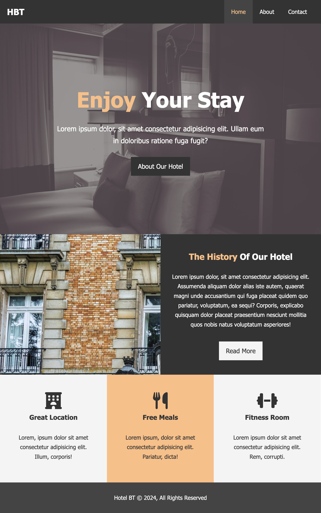
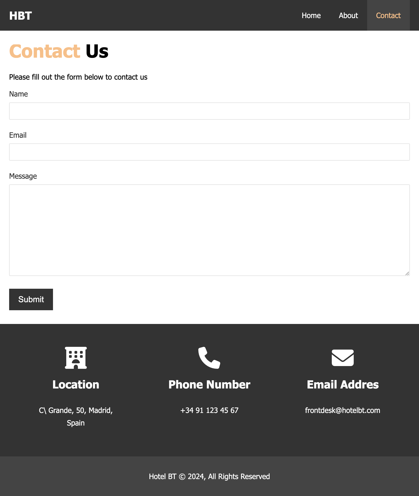

# Basic Website

For this CSS challenge, the instructor provided the images, color hex codes and samples of the desire final look.

The goal was accomplishing a simple corporative website for a hotel, using basic css techniques, and NOT using flex, grid, etc. yet.

**The website will NOT be responsive in this iteration.**

The sections to implement:

- Index: This is the main page, with some basic information about the hotel, including some elements/boxes that have to be created using floats. It uses background images, fontawesome icons, etc

- About: This page contains the hotel information, with a "circular" image and some testimonial cards, with a photo and a text. These testimonial cards have to be slightly translucid, so that the opacity feature is used.

- Contact page: The contact page contains a basic form and, again, some boxes to be positioned using floats, and using more fontawesome icons.

# Resulting pages

Browse it [here](https://miguelsaddress.github.io/css-challenges/hotel_website/src/)

## Main page

## About page

## Contact page

