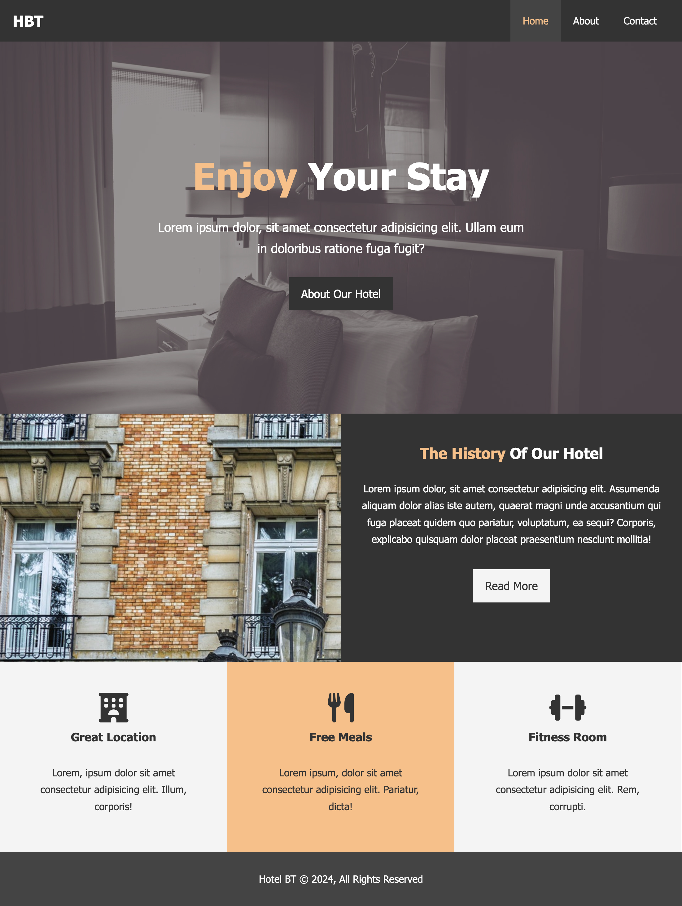

# Basic Website: Responsive edition

This is the same challenge as the hotel website, but now it must be responsive to different screen sizes.

It still must use floats, no flex or grid are allowed.

# Resulting pages

## Mobile Sample (Iphone 14 Pro Max emulation)

Browse it [here](https://miguelsaddress.github.io/css-challenges/hotel_website_responsive/src/)

### Main page

### About page

### Contact page

## Desktop

Browse it [here](https://miguelsaddress.github.io/css-challenges/hotel_website/src/)

### Main page

### About page

### Contact page

