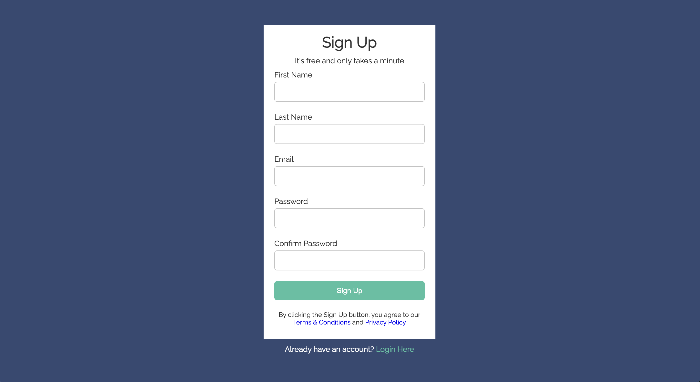

# Form Styling

Basic form styling challenge. Given a basic HTML form and the font and colors to use, make it look as similar to the provided one as possible.

Browse it [here](https://miguelsaddress.github.io/css-challenges/login-form-styling/form_styling.html)

# Resulting Form

